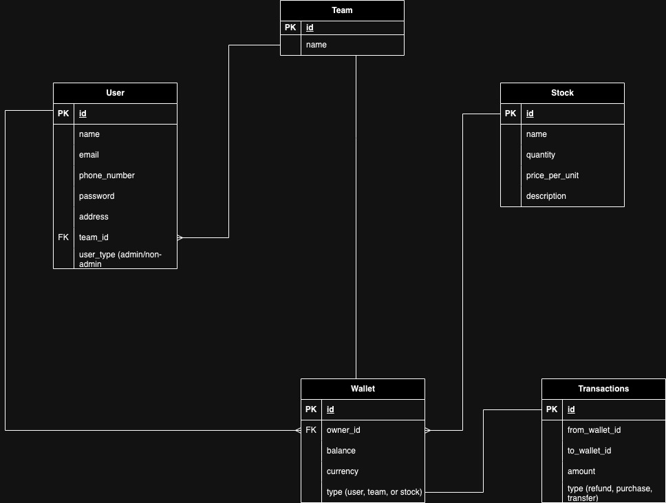

# wallet-transactions

## ERD



- User entity represents customer or end-user of wallet system
- Team entity represents of organizations or group that agreed to be a team to do collective transactions such as split bill.
- Stock entity represents stock that contains how many stock is left and also price per unit
- Wallet entity represents balance/deposit that belongs to user, team, or stock
- Transactions entity represents money movement (money in and money out) between wallets.

### Relation Between Entities

- Team has one to many relationship to users. One of user will have admin role that granted another user to do transaction using team wallet. When non admin user is trying to deduct transaction using team's wallet, they need approval from admin user. Once admin user approve the transaction, balance from team wallet will be deducted.
- User has one to many relationship to wallets. Users can have multiple wallet to manage their money.
- Team has one to one relationship with wallet. Wallet that belongs to team is shared walled that can be accesed by every user in a team. For non admin user is limited that need approval from user that as admin role.
- Stock has one to one relationship wallet. The balance in wallet's stock represents quantity of stock.
- Wallet and transactions has many to many relationship.

### How to install and run application

- This project is build with rails version 7 and ruby version 3
- Clone project into your computer
- Run this command install gem's dependencies

```
    bundle install
```

- Run this command to migrate database

```
    rails db:migrate
```

- Run this command to start application

```
    rails s
```

### Documentaion

- For documentation you can read by following by open the static page under `/doc` folder
